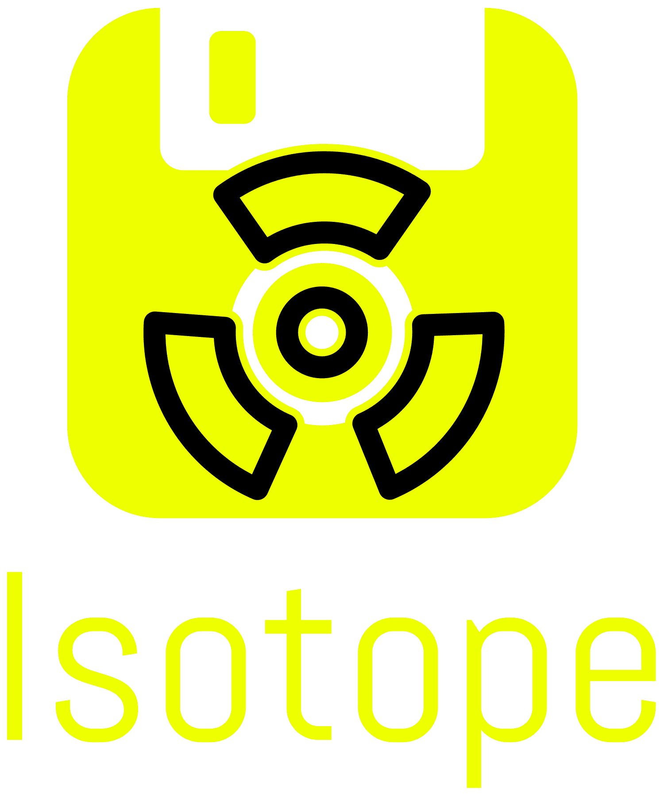

<div align="center">

<p>
  
</p>

**A flexible, OS-agnostic ISO builder for automated deployments**

[](https://www.rust-lang.org/)
[](https://opensource.org/licenses/MIT)
[](https://github.com/yourusername/isotope)

</div>

---

## 🚀 Overview

ISOtope is a powerful, Rust-based CLI tool that makes ISO customization simple. With a clean JSON configuration format, ISOtope gives you complete control over building custom OS images while avoiding the complexity of traditional solutions.

```bash
isotope build config.json
```

Think of ISOtope as what Packer *should* have been: powerful automation without the headaches of HCL configuration and with greatly improved configurability.

## ✨ Features

- **OS-Agnostic Design**: Works with any operating system (Windows, Linux, macOS, BSD, etc.)
- **Clean JSON Configuration**: Human-readable, simple structure without unnecessary complexity
- **Powerful Customization**:
  - File modifications
  - Package installation
  - Automation sequencing
  - Boot configuration
  - Post-installation scripting
- **Virtualization Integration**: Automated testing and validation
- **Fast Performance**: Built with Rust for optimal speed and resource usage
- **Robust Validation**: Built-in verification of outputs

## 🔧 Installation

```bash
# Install via cargo
cargo install isotope
```

## 📋 Example Configuration

(see examples directory)

## 🛠️ Use Cases

ISOtope is designed for several key scenarios:

### Enterprise Deployment

Create standardized operating system images with pre-configured applications, security settings, and corporate policies for consistent deployment across thousands of workstations.

### Cloud Infrastructure

Build custom cloud images with specific configurations, packages, and optimizations for your infrastructure requirements.

### Development Environments

Craft reproducible development environments with all necessary tools, libraries, and configurations pre-installed.

### Automated Testing

Generate test environments with different OS configurations for comprehensive application testing.

### OmniCloud Use Case

At OmniCloud, we use ISOtope internally for automating Live VM ISO creation to support rapid mass-deployment of virtual machines. This allows us to:

- Reduce VM provisioning time from hours to minutes
- Ensure consistency across thousands of deployments
- Customize images on-the-fly based on customer requirements
- Maintain version control of our deployment configurations
- Automate testing of new releases before deployment

## 🏗️ Building from Source

```bash
# Clone the repository
git clone https://github.com/OmniCloudOrg/isotope.git
cd isotope

# Build the project
cargo build --release

# Run tests
cargo test
```

## 🤝 Contributing

Contributions are welcome! Please feel free to submit a Pull Request.

1. Fork the repository
2. Create your feature branch (`git checkout -b feature/amazing-feature`)
3. Commit your changes (`git commit -m 'Add some amazing feature'`)
4. Push to the branch (`git push origin feature/amazing-feature`)
5. Open a Pull Request

## 📄 License

This project is licensed under the MIT License - see the [LICENSE](LICENSE) file for details.

## 📞 Support

- Create an [Issue](https://github.com/OmniCloudOrg/Isotope/issues)

---

<div align="center">
  <sub>Built with ❤️ by the OmniCloud Community</sub>
</div>
